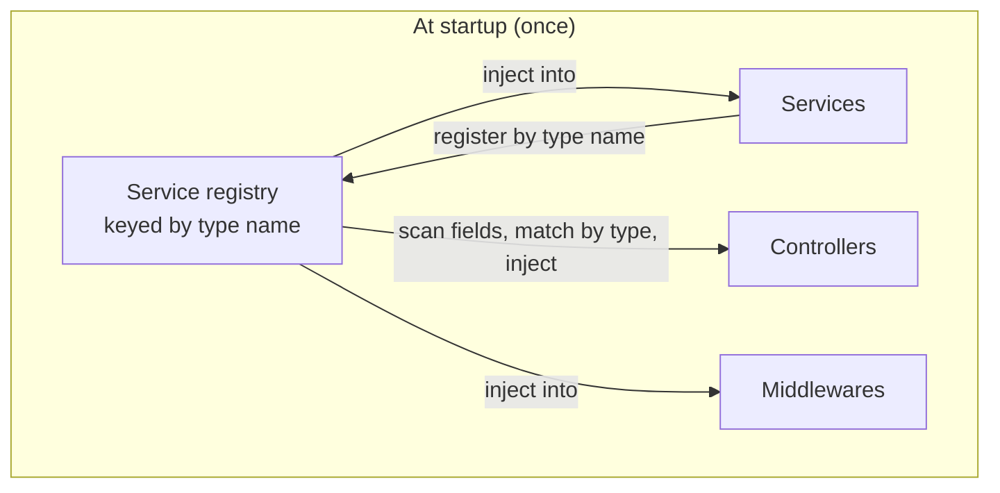
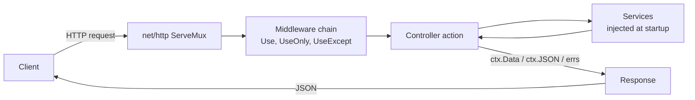

<p align="center">
  
</p>

<h1 align="center">Raptor</h1>

<p align="center">
  <strong>Go MCS (Model–Controller–Service) web framework built on net/http with automatic dependency injection — designed for simplicity, productivity, and performance.</strong>
</p>

<p align="center">
  <a href="https://pkg.go.dev/github.com/go-raptor/raptor/v4"></a>
  <a href="https://github.com/go-raptor/raptor/tags"></a>
  
  <a href="https://goreportcard.com/report/github.com/go-raptor/raptor/v4"></a>
  <a href="LICENCE"></a>
</p>

---

Raptor is a small, fast web framework for building APIs in Go. It gives your project a clear structure and wires everything together with automatic dependency injection — all on top of the standard `net/http`, and built around three things Go developers actually care about: **simplicity, productivity, and performance**.

You write models, controllers, and services. Raptor wires them together and gets out of the way. 🦖

```go
func main() {
	raptor.New(components.New(), config.Routes()).Run()
}
```

That single line loads your configuration, runs dependency injection, starts the HTTP server, and handles graceful shutdown.

## Table of contents

- [What is Raptor?](#what-is-raptor)
- [Highlights](#highlights)
- [Quickstart](#quickstart)
- [Core concepts](#core-concepts)
  - [The application entrypoint](#the-application-entrypoint)
  - [Dependency injection](#dependency-injection)
  - [Controllers and the request context](#controllers-and-the-request-context)
  - [Services and lifecycle](#services-and-lifecycle)
  - [Routing](#routing)
  - [Middleware](#middleware)
  - [Errors](#errors)
  - [Configuration](#configuration)
  - [The request lifecycle](#the-request-lifecycle)
- [The Raptor ecosystem](#the-raptor-ecosystem)
- [Use cases](#use-cases)
- [Performance](#performance)
- [Extensibility](#extensibility)
- [Project status](#project-status)
- [Contributing](#contributing)
- [License](#license)
- [Acknowledgements](#acknowledgements)

## What is Raptor?

Most Go web frameworks hand you a router and a middleware chain, then leave the architecture of your application entirely up to you. That is liberating on day one and a maze by month six.

Raptor keeps the parts that make a project pleasant to work on — a predictable shape (the **MCS** triad: Models, Controllers, and Services) and automatic dependency injection, so components find each other without wiring boilerplate — and pairs them with a small, sharp toolset (CLI, connectors, middleware). The guiding idea is the one that made Ruby on Rails so productive: a framework should help you move fast. Raptor pursues that the Go way — favoring **simplicity, productivity, and performance** over magic.

It does all of this directly on top of `net/http`. Routing is the standard library's own `http.ServeMux` (Go 1.22+), not a bespoke engine. Like most ergonomic frameworks, Raptor hands each request a convenient `Context` — but it is a thin layer over the standard `*http.Request` and `http.ResponseWriter`, both always one call away via `ctx.Request()` and `ctx.Response()`, so ordinary `net/http` handlers and middleware drop straight in. And because dependency injection is resolved once at startup, there is no reflection on the request path.

Every design decision serves these goals:

- **Simplicity** — sensible defaults, a generator, and a structure you do not have to invent.
- **Productivity** — automatic DI and code generation mean less plumbing and more shipping.
- **Performance** — a thin layer over `net/http` with DI resolved at startup, compiled into one small, fast static binary.
- **Extensibility** — connectors, middleware, loggers, and IP extractors are all pluggable, and standard `net/http` components work as-is.

## Highlights

- **🧬 Automatic dependency injection** — declare a typed field, get the instance. No containers, no `wire`, no constructors to thread through your app.
- **🗂️ MCS architecture** — Models, Controllers, and Services, each with a clear job. Onboarding is reading a directory tree.
- **⚙️ Built on net/http** — Go 1.22+ routing, standard handlers, and the entire `net/http` middleware ecosystem are available to you.
- **🧰 A sharp toolset, not a kitchen sink** — a CLI (`raptor new`, generators, hot-reload dev server, migrations), official database connectors, and a few essential middlewares. The common pieces, none of the bloat.
- **📨 Declarative routing** — define routes in readable YAML, or build them programmatically — your choice.
- **🧯 Typed errors** — return `errs.NewErrorNotFound("…")` and Raptor serializes a clean JSON error with the right status code.
- **🪵 Structured logging** — `log/slog` out of the box, with a pluggable handler.
- **🛡️ Graceful by default** — config loading, service lifecycle hooks, and signal-aware shutdown are handled for you.
- **🪶 Tiny footprint** — a Raptor app is a single static binary with no runtime and no dependencies. Complete APIs commonly ship in a 5–10 MB container (or none at all) and run in tens of MB of RAM.

## Quickstart

Install the CLI:

```bash
go install github.com/go-raptor/cli/cmd/raptor@latest
```

Scaffold a new project, then start the hot-reloading dev server:

```bash
raptor new github.com/you/myapp
cd myapp
raptor dev
```

You'll see Raptor come to life:

```
🟢 Raptor v4.2.1 is running on 127.0.0.1:3000! 🦖💨
```

Call your first endpoint:

```bash
curl http://localhost:3000/api/v1/hello
# {"message":"Hello, World!","greetings":[]}
```

### What `raptor new` gives you

```
myapp/
├── app/
│   ├── controllers/
│   │   ├── hello_controller.go
│   │   ├── hello_controller_test.go
│   │   └── setup_test.go
│   └── services/
│       ├── hello_service.go
│       ├── hello_service_test.go
│       └── setup_test.go
├── config/
│   ├── components/
│   │   ├── components.go      # assembles Services + Controllers + Middlewares
│   │   ├── controllers.go     # registers controllers
│   │   ├── middlewares.go     # registers middlewares
│   │   └── services.go        # registers services
│   ├── routes.go              # embeds routes.yaml
│   └── routes.yaml            # declarative routes
├── .raptor.dev.yaml           # dev configuration
├── .raptor.test.yaml          # test configuration
├── go.mod
└── main.go
```

A working app with controllers, services, dependency injection, routing, config, and tests — generated, not hand-rolled.

## Core concepts

### The application entrypoint

A Raptor app is created with `raptor.New(components, routes, opts...)` and started with `.Run()`:

```go
package main

import (
	"github.com/go-raptor/raptor/v4"
	"github.com/you/myapp/config"
	"github.com/you/myapp/config/components"
)

func main() {
	raptor.New(
		components.New(), // your services, controllers, middlewares, (and connector)
		config.Routes(),  // your routes
	).Run()
}
```

`Run()` loads configuration (from YAML files and environment variables), initializes and injects your components, starts the `net/http` server, and shuts down gracefully on `SIGINT`/`SIGTERM`.

Options tailor the runtime — for example a custom `slog` handler or a programmatic config:

```go
raptor.New(
	components.New(),
	config.Routes(),
	raptor.WithLogHandler(func(level *slog.LevelVar) slog.Handler {
		return tint.NewHandler(os.Stderr, &tint.Options{Level: level})
	}),
	raptor.WithConfig(&config.Config{
		ServerConfig: config.ServerConfig{Port: 8080},
	}),
).Run()
```

### Dependency injection

This is Raptor's signature feature. Components declare what they need as **typed fields**, and Raptor fills them in automatically at startup.

A service holds business logic:

```go
package services

import "github.com/go-raptor/raptor/v4"

type HelloService struct {
	raptor.Service

	greetings []string
}

func (s *HelloService) Setup() error {
	s.greetings = []string{}
	return nil
}

func (s *HelloService) Greeting() string { return "Hello, World!" }
func (s *HelloService) Greetings() []string { return s.greetings }
func (s *HelloService) AddGreeting(g string) { s.greetings = append(s.greetings, g) }
```

A controller depends on it — just add a field of the service's type:

```go
package controllers

import (
	"net/http"

	"github.com/go-raptor/raptor/v4"
	"github.com/go-raptor/raptor/v4/errs"
	"github.com/you/myapp/app/services"
)

type HelloController struct {
	raptor.Controller

	Hello *services.HelloService // ← injected automatically at startup
}

func (c *HelloController) Greet(ctx *raptor.Context) error {
	return ctx.Data(map[string]any{
		"message":   c.Hello.Greeting(),
		"greetings": c.Hello.Greetings(),
	})
}

func (c *HelloController) AddGreetings(ctx *raptor.Context) error {
	var request struct {
		Greeting string `json:"greeting"`
	}
	if err := ctx.Bind(&request); err != nil {
		return errs.NewErrorBadRequest("invalid request")
	}
	c.Hello.AddGreeting(request.Greeting)
	return ctx.Status(http.StatusCreated)
}
```

You register components in one place:

```go
// config/components/services.go
func Services() raptor.Services {
	return raptor.Services{
		&services.HelloService{},
	}
}

// config/components/controllers.go
func Controllers() raptor.Controllers {
	return raptor.Controllers{
		&controllers.HelloController{},
	}
}
```

**How the wiring works.** At startup Raptor registers each service under its **type name** (`HelloService`), then scans every controller, service, and middleware for pointer-to-struct fields. When a field's type matches a registered service, Raptor injects the shared instance. The field name is yours to choose (`Hello` above) — the match is on the type, not the name. Services can depend on other services the same way.



Because injection happens **once at boot**, there is **no reflection per request**, and a missing dependency is a startup error — not a `nil` panic in production.

### Controllers and the request context

A controller action is any method with the signature `func(ctx *raptor.Context) error`. The `Context` is your single, focused handle on the request and response:

```go
func (c *UsersController) Show(ctx *raptor.Context) error {
	id := ctx.Param("id") // path parameter: /users/{id}

	user, err := c.Users.Find(id)
	if err != nil {
		return errs.NewErrorNotFound("user not found")
	}

	return ctx.Data(user) // 200 + JSON
}
```

Common `Context` methods include `Bind`, `Param`, `Query`/`QueryParam`, `Cookie`, `RealIP`, `Get`/`Set` (request-scoped storage), and responders such as `Data`, `JSON`, `String`, `Status`, `NoContent`, and `Redirect`. `ctx.Data(v)` writes JSON with `200 OK`; pass a status for anything else: `ctx.Data(v, http.StatusCreated)`.

### Services and lifecycle

Services embed `raptor.Service`, which gives them access to shared **resources** — the structured logger, the loaded config, and the database connector:

```go
type ReportService struct {
	raptor.Service
}

func (s *ReportService) Setup() error {
	s.Log.Info("warming up report cache")
	return nil
}
```

Services may implement optional lifecycle hooks, each called at the right moment:

| Hook                     | When it runs                                                           |
| ------------------------ | ---------------------------------------------------------------------- |
| `Init(*Resources) error` | Provided by the embedded `raptor.Service`; resources become available. |
| `Setup() error`          | After resources are injected — ideal for warm-up and connections.      |
| `Cleanup() error`        | During graceful shutdown, in reverse registration order.               |
| `Shutdown() error`       | During graceful shutdown, after `Cleanup`.                             |

### Routing

Routes are declared in readable YAML and embedded into your binary:

```yaml
# config/routes.yaml
routes:
  /api/v1:
    /hello:
      GET: Hello.Greet
      POST: Hello.AddGreetings
```

```go
// config/routes.go
//go:embed routes.yaml
var routesYAML []byte

var routes = raptor.Must(router.ParseRoutesYAML(routesYAML))

func Routes() router.Routes { return routes }
```

A handler reference like `Hello.Greet` maps to `HelloController.Greet` — the `Controller` suffix is implied. Prefer code? The same routes, built programmatically:

```go
routes := router.CollectRoutes(
	router.Scope("/api/v1",
		router.Get("/hello", "Hello.Greet"),
		router.Post("/hello", "Hello.AddGreetings"),
		router.Get("/users/{id}", "Users.Show"), // Go 1.22+ path params → ctx.Param("id")
	),
)
```

Unmatched paths and methods are handled by a built-in errors controller, returning clean `404` and `405` responses automatically.

### Middleware

Middleware embeds `raptor.Middleware` and implements `Handle(ctx, next)`:

```go
type AuthMiddleware struct {
	raptor.Middleware
}

func (m *AuthMiddleware) Handle(ctx *raptor.Context, next func(*raptor.Context) error) error {
	if ctx.Request().Header.Get("Authorization") == "" {
		return errs.NewErrorUnauthorized("missing token")
	}
	return next(ctx)
}
```

Register middleware with the scope you want — globally, only on certain actions, or everywhere except a few:

```go
func Middlewares() raptor.Middlewares {
	return raptor.Middlewares{
		core.Use(&logger.LoggerMiddleware{}),                 // every request
		core.UseExcept(&AuthMiddleware{}, "Auth.Login"),      // all but login
		core.UseOnly(&AuditMiddleware{}, "Admin"),            // only the Admin controller
	}
}
```

Already have a standard `net/http` middleware? Wrap it without changes:

```go
core.UseStd(someStdMiddleware) // func(http.Handler) http.Handler
```

### Errors

Return a typed error from any action and Raptor renders it as JSON with the matching HTTP status:

```go
return errs.NewErrorNotFound("user not found")
// HTTP 404 → {"code":404,"message":"user not found"}
```

The `errs` package ships constructors for the full range of 4xx/5xx statuses (`NewErrorBadRequest`, `NewErrorUnauthorized`, `NewErrorForbidden`, `NewErrorConflict`, `NewErrorUnprocessableEntity`, `NewErrorTooManyRequests`, `NewErrorInternal`, …), plus `NewError(code, message, attrs...)` for anything custom. Attach structured attributes for richer responses, or wrap an underlying cause with `.WithCause(err)`.

### Configuration

Configuration is read from `.raptor.yaml` (with environment-specific variants like `.raptor.dev.yaml` and `.raptor.prod.yaml`), overlaid with environment variables, and optionally overridden in code:

```yaml
general:
  log_level: info
server:
  address: 127.0.0.1
  port: 3000
database:
  host: localhost
  port: 5432
  name: myapp
app:
  cors_allow_origins: "http://localhost:5173"
```

Environment variables map onto the same keys (`SERVER_PORT`, `DATABASE_HOST`, `GENERAL_LOG_LEVEL`), and anything under `app:` (or `APP_*`) is available to your code as application config.

### The request lifecycle



## The Raptor ecosystem

Raptor is more than the core framework. The surrounding modules cover the parts of a real API you would otherwise reinvent.

### CLI

Install: `go install github.com/go-raptor/cli/cmd/raptor@latest` · Repo: [go-raptor/cli](https://github.com/go-raptor/cli)

| Command                                     | What it does                                                                        |
| ------------------------------------------- | ----------------------------------------------------------------------------------- |
| `raptor new <module-path>`                  | Scaffold a new project (structure, `go.mod`, `go mod tidy`).                        |
| `raptor generate <type> <name>` (alias `g`) | Generate a `controller`, `service`, `middleware`, or `model`, with a matching test. |
| `raptor dev` (aliases `serve`, `s`)         | Run a hot-reloading dev server that rebuilds on file changes.                       |
| `raptor db migrate <...>`                   | Run database migrations (`up`, `down`, `status`, `create`, and more).               |
| `raptor test [args]`                        | Thin wrapper around `go test`.                                                      |
| `raptor version`                            | Print the CLI version.                                                              |

Generated controllers and services register themselves automatically; generated middleware is added to your middleware list with one line, and models are plain structs ready to extend.

### Connectors

A **connector** is a pluggable database integration. It manages the connection pool and exposes a migrator — powered by the battle-tested [Goose](https://github.com/pressly/goose) — and is registered through `Components.DatabaseConnector`:

```go
import "github.com/go-raptor/connectors/bun/postgres"

func New() *raptor.Components {
	return &raptor.Components{
		DatabaseConnector: postgres.NewPostgresConnector(db.MigrationsFS()),
		Services:          Services(),
		Controllers:       Controllers(),
		Middlewares:       Middlewares(),
	}
}
```

The live connection is available to every service through the embedded resources:

```go
type UsersService struct {
	raptor.Service

	db *bun.DB
}

func (s *UsersService) Setup() error {
	s.db = s.Database.Conn().(*bun.DB) // typed handle from the connector
	return nil
}
```

| Connector                                                             | Provides                                                      | Install                                                |
| --------------------------------------------------------------------- | ------------------------------------------------------------- | ------------------------------------------------------ |
| [`connectors/pgx`](https://github.com/go-raptor/connectors)           | `*pgxpool.Pool` (raw PostgreSQL via pgx)                      | `go get github.com/go-raptor/connectors/pgx`           |
| [`connectors/bun/postgres`](https://github.com/go-raptor/connectors)  | `*bun.DB` (PostgreSQL via the Bun ORM)                        | `go get github.com/go-raptor/connectors/bun/postgres`  |
| [`connectors/goosemigrator`](https://github.com/go-raptor/connectors) | Migrations via `pressly/goose` (used by the connectors above) | `go get github.com/go-raptor/connectors/goosemigrator` |

### Middlewares

Ready-to-use middleware, each its own module — take only what you need. Repo: [go-raptor/middlewares](https://github.com/go-raptor/middlewares)

| Middleware                                                        | What it does                                                                     | Install                                           |
| ----------------------------------------------------------------- | -------------------------------------------------------------------------------- | ------------------------------------------------- |
| [`middlewares/logger`](https://github.com/go-raptor/middlewares)  | Structured request/response logging via `slog` (method, path, status, duration). | `go get github.com/go-raptor/middlewares/logger`  |
| [`middlewares/cors`](https://github.com/go-raptor/middlewares)    | Configurable CORS, including origin patterns and preflight handling.             | `go get github.com/go-raptor/middlewares/cors`    |
| [`middlewares/limiter`](https://github.com/go-raptor/middlewares) | Token-bucket rate limiting per client IP.                                        | `go get github.com/go-raptor/middlewares/limiter` |

### Example app

[**raptor-example-app**](https://github.com/h00s/raptor-example-app) is a minimal, runnable project generated with `raptor new`. It demonstrates the MCS layout, dependency injection, declarative routing, and middleware registration — the perfect place to start reading.

## Use cases

Raptor is built for **HTTP/JSON APIs**, and shines wherever a clear structure pays off over time:

- **REST and JSON APIs** — the framework's home turf.
- **Backends for SPAs and mobile apps** — typed JSON responses and tidy error envelopes.
- **Microservices** — small footprint, fast startup, standard `net/http` underneath.
- **IoT and event-driven backends** — long-lived services (e.g. MQTT consumers) fit naturally as Raptor services with lifecycle hooks.
- **Internal tools and admin APIs** — generators get a new resource online in seconds.

These are not hypotheticals. Raptor runs in production today, backing applications that combine token authentication and sessions, role-based authorization, audit logging, in-memory caching, async background workers, MQTT device communication, and PostgreSQL via the Bun ORM with Goose migrations — all on the same MCS structure shown above.

## Performance

Raptor is designed to stay out of the request's way. The performance story is architectural:

- **Thin layer over `net/http`.** Routing uses the standard `http.ServeMux` (Go 1.22+). There is no bespoke router or parallel HTTP stack to pay for.
- **Dependency injection resolved once, at startup.** Components are wired during boot, so there is **zero reflection on the request path** — handler calls are ordinary method calls.
- **Pooled request contexts.** `Context` objects are recycled via `sync.Pool` to keep per-request allocations low.
- **O(1) service lookup** and **pre-compiled middleware chains.** Each route's middleware stack is assembled at startup, not rebuilt per request.
- **Cached response plumbing.** The `http.ResponseController` is cached rather than reallocated.

**A tiny footprint, too.** Because a Raptor app is just Go, it compiles to a **single static binary** — no runtime, no interpreter, no shared libraries to install. There is nothing to deploy but the binary itself: drop it on a host and run it, or wrap it in a minimal container. In practice a complete API fits in a **5–10 MB image** (and a container isn't required at all), while memory stays low — a small service idles around **~10 MB of RAM**, and a production app serving both an API and a static frontend typically runs in **~30 MB**.

> Formal, reproducible throughput benchmarks are on the roadmap. The footprint numbers above are typical figures from real apps built with Raptor; the architectural points describe the design rather than lab measurements — and we'd rather be honest about which is which.

## Extensibility

Nothing in Raptor is a dead end:

- **Write your own connector** by implementing the `connectors.DatabaseConnector` interface — bring any database you like.
- **Write your own middleware** with the `Handle(ctx, next)` contract, or wrap any existing `net/http` middleware with `core.UseStd`.
- **Use standard handlers** anywhere via the framework's `net/http` compatibility helpers.
- **Swap the logger** with any `slog.Handler`, and **choose how client IPs are resolved** (`direct`, `x-real-ip`, or `x-forwarded-for`) through configuration.

## Project status

Raptor is actively developed. The current release is **v4.2.1**, requires **Go 1.26+**, and follows semantic versioning. Because it is a v4 module, the import path is:

```go
import "github.com/go-raptor/raptor/v4"
```

## Contributing

Issues, ideas, and pull requests are welcome. If you are planning a larger change, opening an issue first to discuss the direction is appreciated.

## License

Raptor is released under the [MIT License](LICENCE). © 2026 Krunoslav Husak.

## Acknowledgements

Raptor takes its cue from **Ruby on Rails** — the idea that a framework can keep you productive without getting in your way — while staying true to Go's love of simplicity and speed. It is built directly on the Go standard library, and its connectors lean on excellent projects like [Goose](https://github.com/pressly/goose), [Bun](https://bun.uptrace.dev/), and [pgx](https://github.com/jackc/pgx).

<p align="center"><em>Build fast. Ship fast. Run fast. 🦖💨</em></p>
